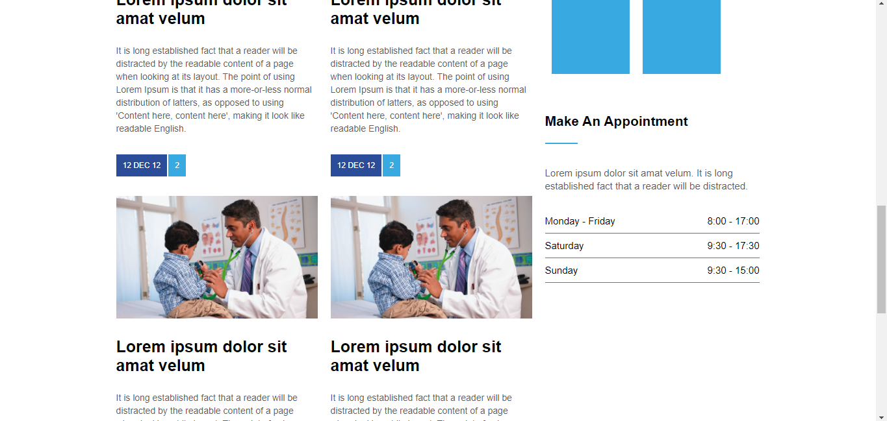

# Medicenter 

Projeto simples de um website usando HTML e Css. Projeto feito com o conteúdo das aulas da B7web.

## Introdução

Há menos de uma semana comprei o curso fullstack B7web para melhorar meu nível de programação e conhecimento, além de garantir um certificado que atesta que estou acostumado a desenvolver sistemas web. Assim, mesmo tendo um conhecimento considerável de programação básica (HTML, CSS e Js), estou passando pelo módulo Html e CSS para aumentar ainda mais o meu nível. Assim, no seguimento das aulas, foram propostas aulas através do desenvolvimento de um projeto de um site simples com desafios únicos para os alunos.

O Medicenter é um projeto de site para uma empresa com foco na área médica.

Nas imagens abaixo é possível visualizar toda a estrutura, além dos desafios concluídos.

